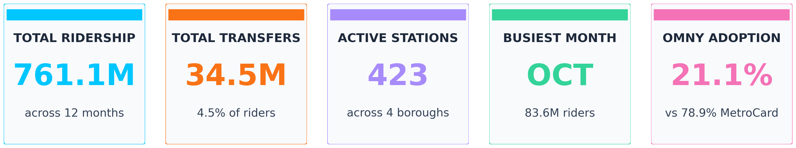
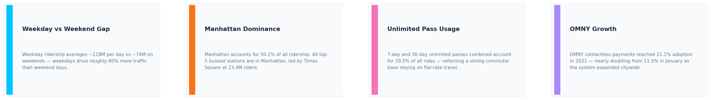
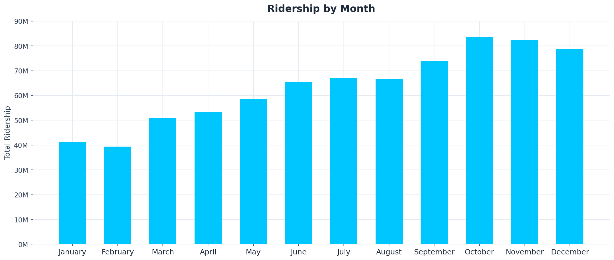
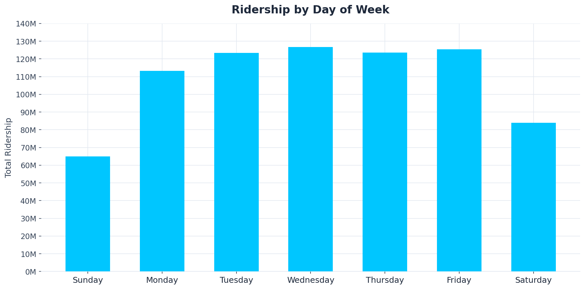
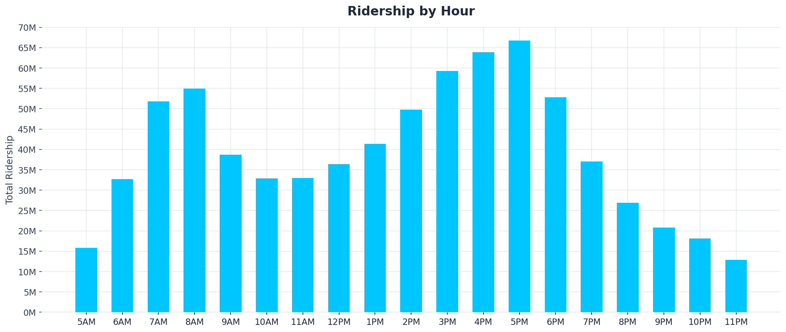
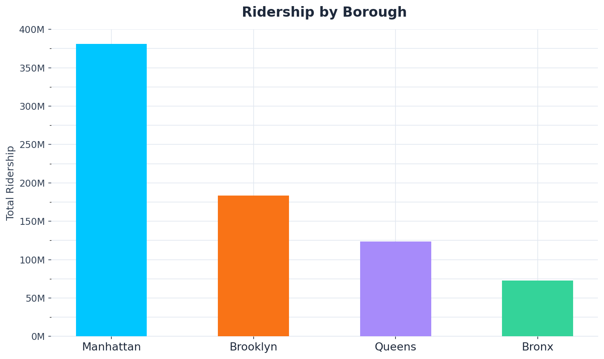
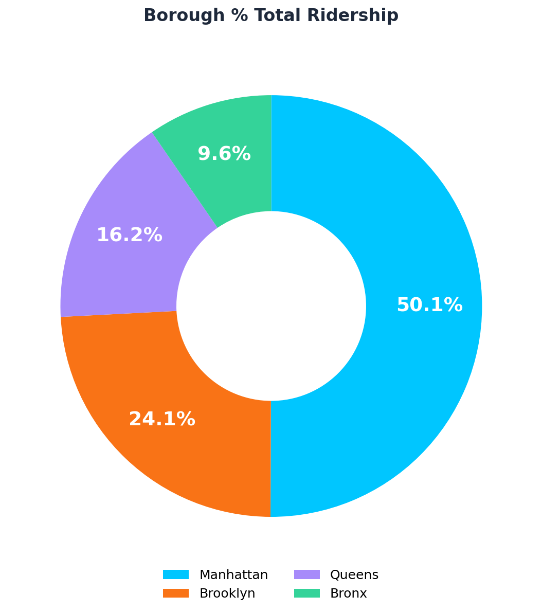
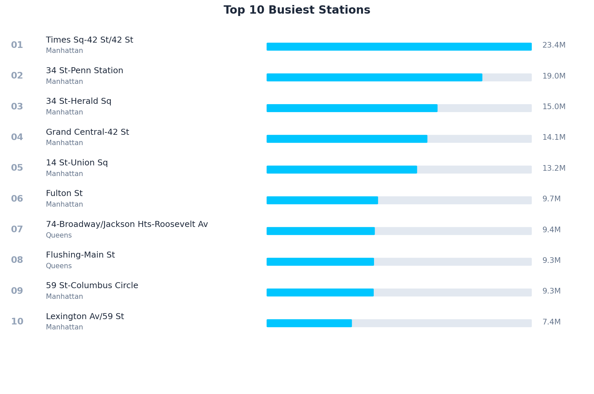
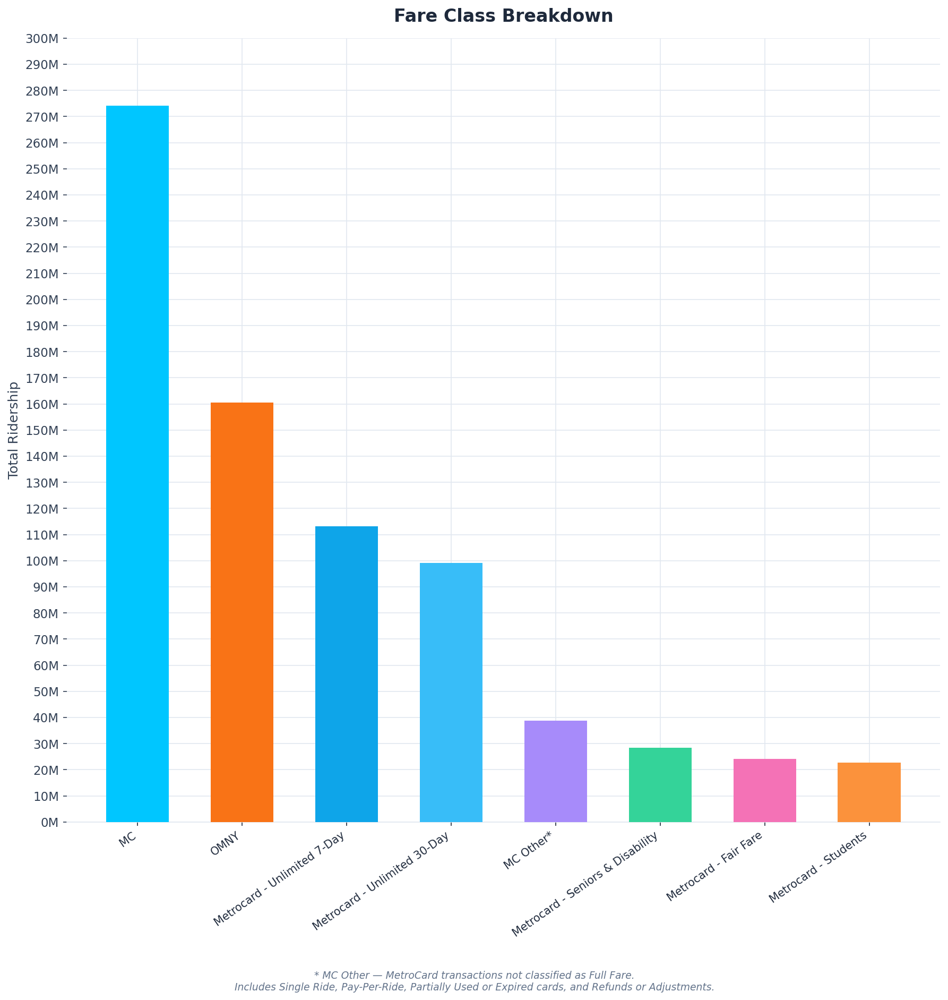

# 🚇 MTA Subway Ridership Analysis (2021)

An exploratory data analysis of New York City subway ridership for the full calendar year 2021, using hourly turnstile data from the [MTA Open Data Portal](https://data.ny.gov/resource/wujg-7c2s.json).

---

## 📌 Project Overview

This project collects, cleans, and analyzes over 23 million rows of MTA subway ridership data across all 423 active station complexes in NYC. The goal is to uncover ridership patterns by time (hour, day, month), geography (borough, station), and fare type (OMNY vs. MetroCard).

### Key Findings

| Metric | Value |
|---|---|
| Total Ridership | 761.1M |
| Total Transfers | 34.5M (4.5% of riders) |
| Active Stations | 423 across 4 boroughs |
| Busiest Month | October (83.6M riders) |
| OMNY Adoption | 21.1% vs. 78.9% MetroCard |

---

## 📁 Project Structure

```
├── data/
│   ├── mta_2021_01.csv       # Raw monthly data (Jan–Dec)
│   ├── ...
│   ├── mta_2021_12.csv
│   └── mta_2021_clean.csv    # Combined & cleaned dataset
├── output/
│   └── kpi_cards.png         # KPI dashboard visualization
├── notebooks/
│   ├── data_acquisition.ipynb      # API data collection
│   ├── mvp.ipynb                   # Data cleaning & EDA
│   └── data_visualizations.ipynb   # Charts & visualizations
└── README.md
```

---

## 🗃️ Dataset

**Source:** [MTA Subway Hourly Ridership — data.ny.gov](https://data.ny.gov/resource/wujg-7c2s.json)

The dataset captures subway entries at turnstiles via OMNY tap or MetroCard swipe, aggregated at the hourly level by station complex and fare class.

**Key fields:**

| Field | Description |
|---|---|
| `transit_timestamp` | Hour of entry (rounded down) |
| `station_complex` | Station name and lines served |
| `borough` | Bronx, Brooklyn, Manhattan, or Queens |
| `payment_method` | `omny` or `metrocard` |
| `fare_class_category` | Consolidated fare type (e.g., Full Fare, Unlimited 30-Day, Senior & Disability) |
| `ridership` | Total entries for that hour/station/fare combination |
| `transfers` | Free bus-to-subway or out-of-network transfers (subset of ridership) |
| `latitude` / `longitude` | Station coordinates |

---

## ⚙️ Notebooks

### 1. `data_acquisition.ipynb`
- Makes paginated HTTP GET requests to the MTA Socrata API
- Fetches 2021 subway ridership data month by month (to stay within API limits)
- Saves each month as an individual CSV to `../data/`

### 2. `mvp.ipynb`
- Loads and concatenates all 12 monthly CSVs into a single DataFrame (~23M rows)
- Cleans and standardizes data: datetime parsing, column engineering (year, month, day, hour, day of week), and duplicate station name normalization
- Drops unnecessary columns (`transit_mode`, `station_complex_id`, `georeference`)
- Exports cleaned dataset to `mta_2021_clean.csv`
- Performs descriptive statistics and basic EDA: ridership by borough, month, day of week, hour, fare class, and top 10 busiest stations

### 3. `data_visualizations.ipynb`
- Loads the cleaned dataset
- Generates KPI summary cards (Total Ridership, Transfers, Stations, Busiest Month, OMNY Adoption)
- Produces charts for ridership trends by time, geography, and fare type using `matplotlib` and `seaborn`

---

## 📊 Visualizations

### KPI Summary


### Key Insights


### Ridership by Month


### Ridership by Day of Week


### Ridership by Hour


### Ridership by Borough


### Borough % Share of Total Ridership


### Top 10 Busiest Stations


### Fare Class Breakdown


---

## 🛠️ Tech Stack

- **Python 3.12**
- **pandas** — data loading, cleaning, aggregation
- **requests** — API data collection
- **matplotlib** / **seaborn** — visualizations
- **numpy** — numerical operations
- **Jupyter Notebook**

---

## 🚀 Getting Started

### Prerequisites

```bash
pip install pandas requests matplotlib seaborn numpy jupyter
```

### Run the notebooks in order

```bash
# 1. Collect raw data from the MTA API
jupyter notebook notebooks/data_acquisition.ipynb

# 2. Clean data and run EDA
jupyter notebook notebooks/mvp.ipynb

# 3. Generate visualizations
jupyter notebook notebooks/data_visualizations.ipynb
```

> **Note:** Data collection in `data_acquisition.ipynb` makes live API calls and may take several minutes. Monthly CSVs are cached locally — re-runs will skip months already downloaded.

---

## 📄 License

This project uses publicly available open data provided by the MTA under the [New York State Open Data](https://data.ny.gov/) program. No restrictions on data use.
